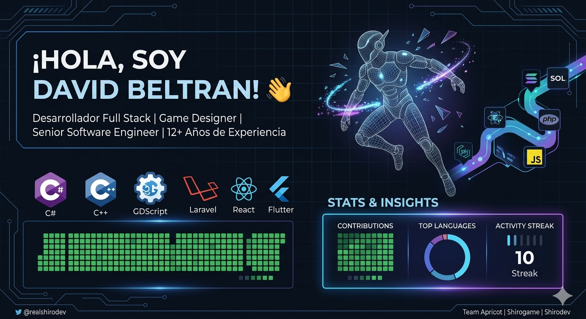

  

# ¡Hola, soy David Beltran! 👋

Desarrollador Full Stack con pasión por el diseño de videojuegos y la arquitectura de software.

### 🛠️ Tecnologías y Herramientas

  

### 🔭 Proyectos Actuales
- 🚀 Desarrollando una plataforma SaaS multi-tenant.
- 🎮 Creando un MVP de un juego Action-Roguelike en 3D.
- 📱 Manteniendo aplicaciones de utilidad en la Play Store.

### 📊 Estadísticas de GitHub

### 📫 Cómo contactarme
[LinkedIn]() | [Instagram](https://www.instagram.com/shirodevof/) | [YouTube](https://www.youtube.com/@shiro_dev/)
