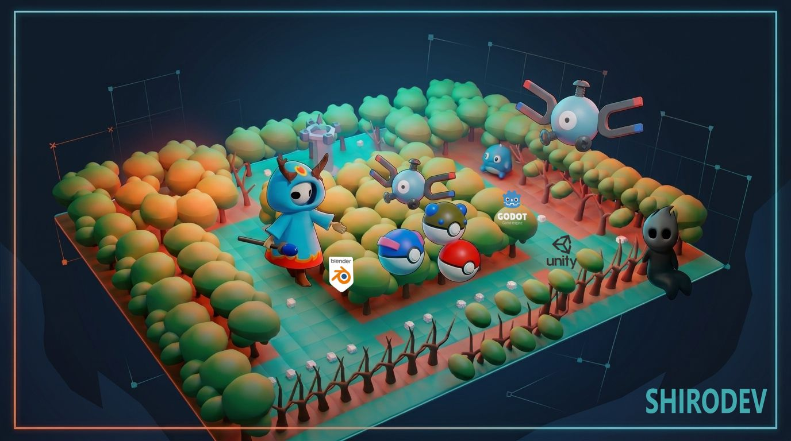

  

# ¡Hola, soy David Beltrán (Shiro)! 👋 🎮💻

Ingeniero en Informática, Desarrollador Full Stack, Game Creator y 2D/3D Technical Artist. Me apasiona construir sistemas de videojuegos, herramientas de optimización para artistas 3D y aplicaciones móviles.

---

### 🛠️ Tecnologías y Herramientas

  

- **Game Dev & 3D Art:** Godot Engine, Unity, Blender (Modeling, Rigging, Shaders, Python Add-ons).
- **Backend & Web:** Laravel, Express.js, Node.js, PHP, JavaScript, TypeScript.
- **Mobile & Plugins:** Flutter, Native Android Plugins (Java/Kotlin) para Godot.

---

### 🔭 Proyectos Actuales & Publicaciones

- 🎨 **[Krita Live Texturing for Blender]():** Add-on para Blender que automatiza la exportación de UVs, apertura de canvas y sincronización en tiempo real con Krita.
- 📱 **Google Play Store:** Creador de **Voxel Pixel Animations** y utilidades en Flutter/Godot.
- 🎮 **Indie Game Dev:** Desarrollando **"Elevator"** (Juego de terror psicológico basado en anomalías) y prototipos 2.5D / 3D.
- 🌐 **Team Apricot Marketplace:** Creando herramientas y assets para desarrolladores e ilustradores 3D.

---

### 📊 Estadísticas de GitHub

  
  

---

### 📫 Conéctate conmigo

  
  
  
  

